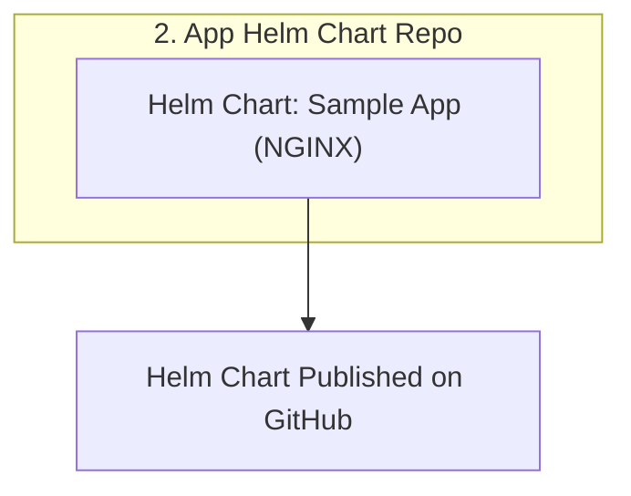

# App Helm Chart Repo Flow

```mermaid
flowchart TD
    subgraph "2. App Helm Chart Repo"
        E["Helm Chart: Sample App (NGINX)"]
    end
    E --> F["Helm Chart Published on GitHub"]
```

**Explanation:**
- The sample NGINX Helm chart is created and published to a GitHub repository for use by FluxCD. 